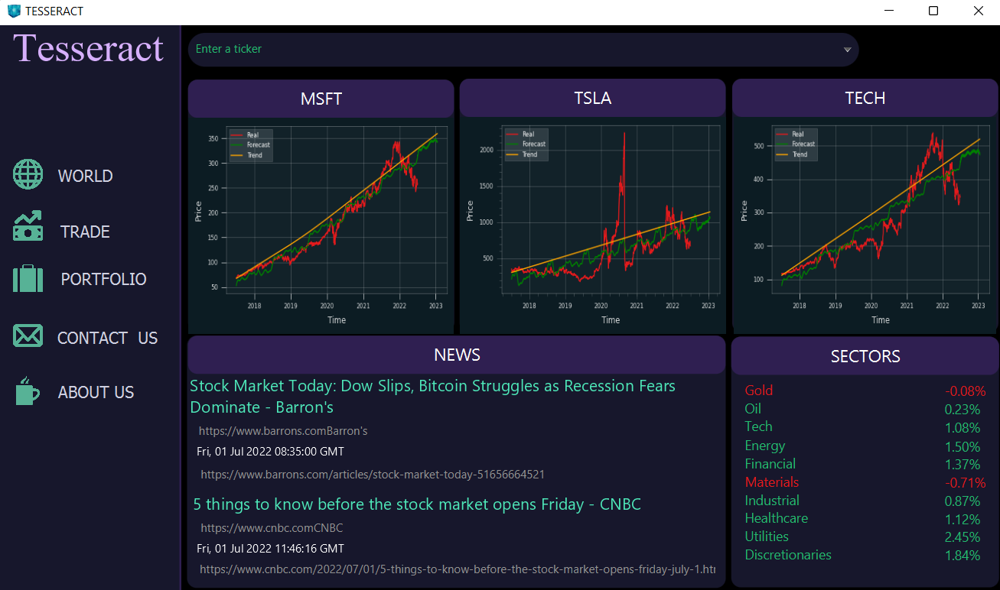
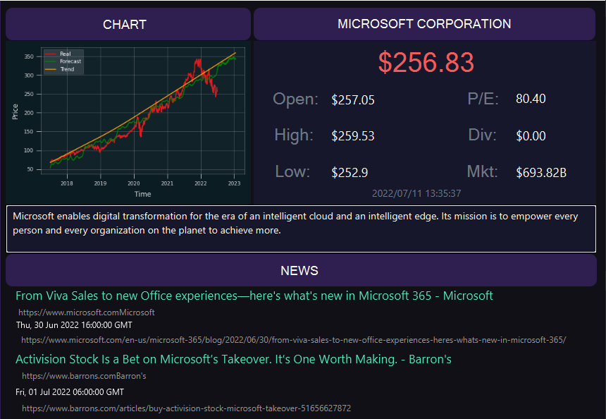
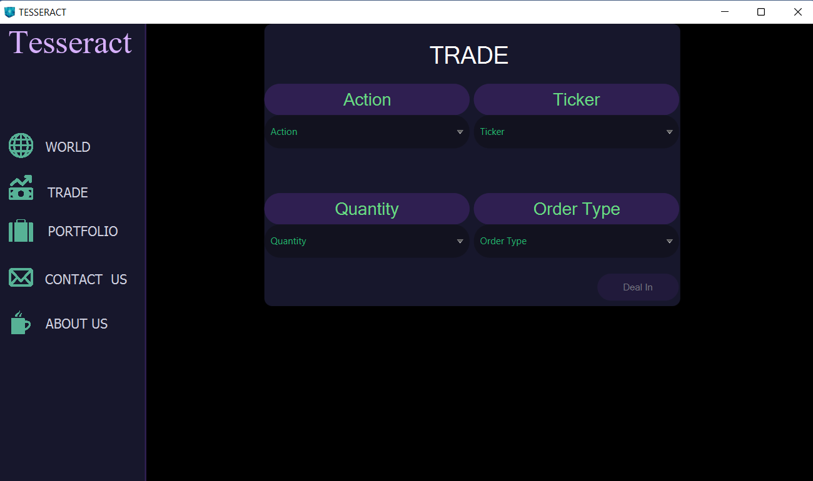
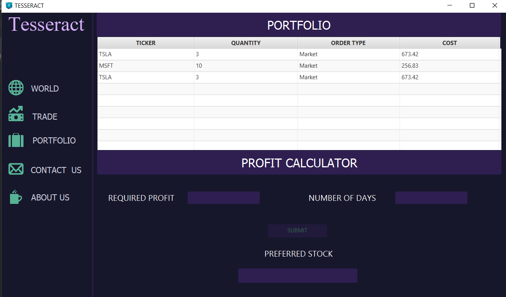
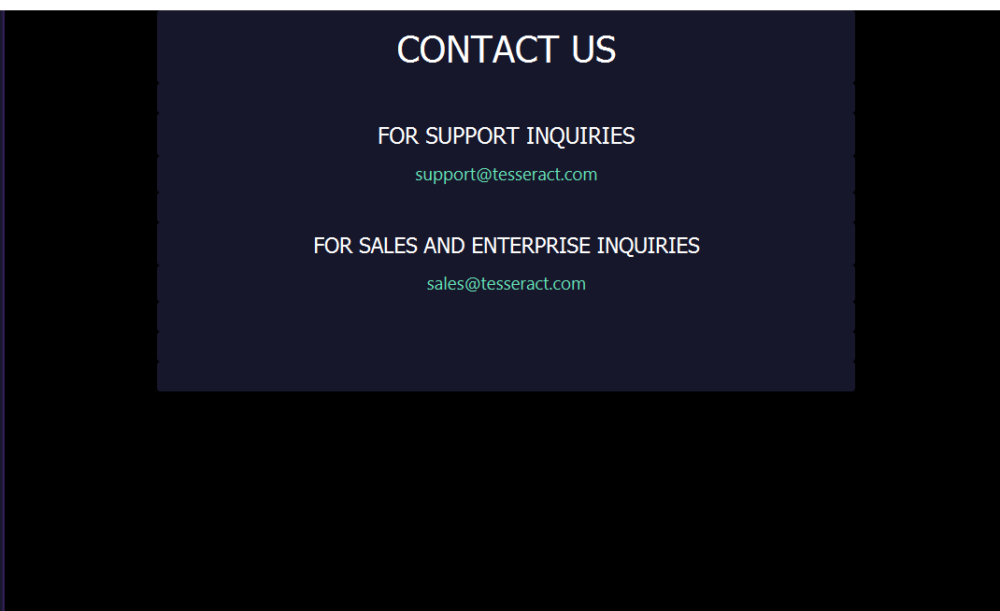
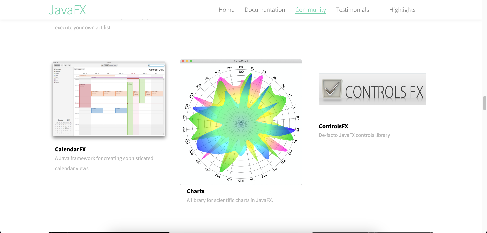
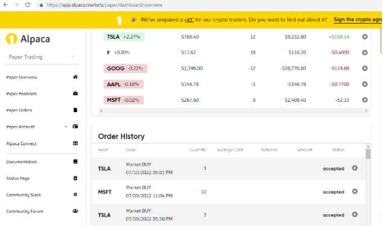
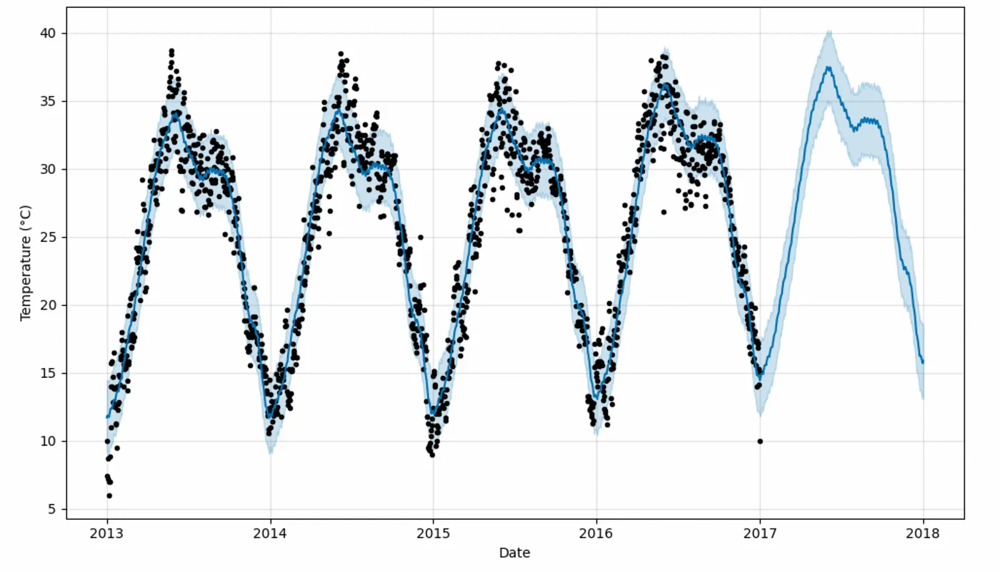

## Tesseract: Stock Market Forecasting :chart_with_upwards_trend: Engine with JavaFX and Facebook Prophet :money_with_wings:

Tesseract is a desktop application made with Java. This application extracts stock market data from api and stores it in csv. Then this data is read by pandas and used by Facebook Prophet to train and forecast the future. This 
forecast is also store in csv and graphs are plotted with matplotlib to visualize the results. I have also made real time stock selling and buying available in
this project with the help of Alpaca api. All the trades can be viewed in the Portfolio panel. This application also helps users in buying and selling stocks by 
finding the average rate of increase or decrease over the last 30 days. 

## Table of Contents
  * [Stock Market Forecasting](#stock-market-forecasting)
  * [JavaFx](#javafx)
  * [Alpaca Trading](#alpaca-trading)
  * [Facebook Prophet](#facebook-prophet)
  * [Setup](#setup)
  * [Todos](#todos)
  * [Acknowledgements](#acknowledgements)
  * [Citation](#citation)
  * [Connect with me](#connect-with-me)


## Stock Market Forecasting

Stock market forecasting is the practice of predicting the future movements of stock prices and market trends based on historical data and various analytical techniques. Accurate forecasting is crucial for investors, traders, and financial institutions to make informed decisions, manage risks, and optimize their investment portfolios. Facebook Prophet is a time series forecasting tool developed by Facebook's Data Science team. It is particularly useful for stock market forecasting due to its simplicity and effectiveness. Prophet can capture and model daily, weekly, and seasonal patterns in stock prices, making it well-suited for the inherent time-based nature of financial data. By utilizing historical stock price data and relevant features, Prophet can generate forecasts, helping investors and traders make more informed decisions regarding their stock market investments. It provides a valuable tool for identifying potential trends and predicting stock price movements, enabling more data-driven and informed trading strategies.

### Homepage

Homepage is the most important window in the program as it is the first window that appears on the screen after when you run the program. WORLD window shows you graphs trends for three most trending stocks in the market. The buyer/seller can look at these graphs and decide what to do based on these trends given by the graphs. Snippet for world window is given below.

<p align="center">

</p>

It also provides you with the latest world news regarding the stock market. User can read the complete article by copying the given link and pasting it in the browser search bar. These articles can be helpful if you want to keep yourself updated with the current world scenarios and can also help you in trading stocks. Sectors are also provided in this window. These can include Gold, Tech, machines, Healthcare etc. as it gives you increasing or decreasing trends of these sectors and whether it is safe for you to invest in these sectors.

<p align="center">

</p>


### Trade

TRADE is another important window that is used to trade different stocks based on the selection of the customer. This is a minimalistic window so that customer would not be overwhelmed and can make trade easily. The user needs to select options from four fields and then click the DealIn button. TRADE window is shown below.

<p align="center">

</p>


### Portfolio

Portfolio window is used to show user all the previous transactions he made, what he bought and what he sold for what price and which stock. This helps the user make remember that how is he spending all his money. Further, below this view is the profit calculator. One may ask what the functionality of this box is. The simple answer is, it tells you which stock to buy based on how many days you have and how much money want. It asks the user for two inputs, the amount he wants to get as output and the number of days in which he wants to have that profit. So, our profit calculator shows the stock name in which the user should invest in.

<p align="center">

</p>


### Contact us

Contact us window is made so that the customer can interact with the faculty and report their problems through the email provided in the contact us window. So that we can work on these problems and resolve them. It is just a basic window so only thing that mattered was the colour scheme which would make it easy for the customer to read and access our email correctly without any mistake. Snippet is shown below.

<p align="center">

</p>


## JavaFx

JAVA FX software has been used to design the Graphical User Interface for TESSERACT. Tesseract has been designed to forecast the trends for different stocks so the buyer or seller can take an idea of the market before making an investment. JAVA FX, although, is one of
the best GUI libraries in JAVA if not the best out there.

<p align="center">

</p>

## Alpaca Trading

Alpaca Trading is a great broker for traders looking to build their own algorithms and focusing on the US market. Its API tools are outstanding, and fees are low: zero stock/ETF commission, and no inactivity or deposit fees. In addition, Alpaca provides free access to software such as Polygon, Alpha Vantage and TradingView, all of which have great research capabilities.

In Tesseract, I have used Alpaca to place realtime buy and sell orders of Tech stocks of Google, Microsoft, Amazon and etc.

<p align="center">

</p>


## Facebook Prophet

FBProphet is a forecasting algorithm developed by Facebook’s data science team in 2017. The algorithm is designed to be scalable, fast, and accurate, making it suitable for a wide range of applications, from predicting sales in e-commerce to forecasting weather patterns. The core idea behind FBProphet is to model time series data as a combination of trend, seasonality, and noise components. By decomposing the data into these components, the algorithm can generate accurate forecasts that capture the underlying patterns in the data.

The trend component captures the overall direction of the time series, whether it is increasing or decreasing over time. This component is modelled using a piecewise linear regression model, which allows for flexibility in fitting the trend to the data.
The seasonality component captures the periodic patterns in the data, such as weekly or monthly trends. This component is modelled using the Fourier series, allowing for flexible modelling of different seasonal patterns.
The noise component captures the random fluctuations in the data that cannot be explained by the trend or seasonality components.
FBProphet uses a Bayesian framework to model the time series data. This means that the algorithm estimates the posterior distribution of the model parameters, rather than just point estimates. By doing so, the algorithm can generate probabilistic forecasts that provide a measure of uncertainty around the point forecast.

<p align="center">

</p>


## Setup

Let's get this thing running! Follow the next steps:

1. `git clone https://github.com/abideenml/Stock-Market-Analyzer`
2. Navigate into project directory `cd Stock-Market-Analyzer/pycast`
3. Get the `API token` from Alpaca website and add your key to `forecasting.py`
3. Create a new venv environment and run `pip install -r requirements.txt`
4. Move to the `src/main` folder and setup the jave project.

That's it! <br/>


## Todos:

Finally there are a couple more todos which I'll hopefully add really soon:

* Make a better UI of the project.
* Make a data pipeline with Kedro and MLflow.
* Deploy the models and learn the effect of drift on their performance.


## Acknowledgements

I found these resources useful (while developing this one):

* [Time series forecasting with Facebook Prophet](https://towardsdatascience.com/time-series-analysis-with-facebook-prophet-how-it-works-and-how-to-use-it-f15ecf2c0e3a)
* [LSTM Illustrated Guide](https://towardsdatascience.com/illustrated-guide-to-lstms-and-gru-s-a-step-by-step-explanation-44e9eb85bf21)
* [Alpaca trading](https://alpaca.markets/docs/introduction/)
* [JavaFX by BroCode](https://www.youtube.com/watch?v=_7OM-cMYWbQ&list=PLZPZq0r_RZOM-8vJA3NQFZB7JroDcMwev&ab_channel=BroCode)


## Citation

If you find this code useful, please cite the following:

```
@misc{Zain2023StockMarketAnalyzer,
  author = {Zain, Abideen},
  title = {stock-market-analyzer},
  year = {2023},
  publisher = {GitHub},
  journal = {GitHub repository},
  howpublished = {\url{https://github.com/abideenml/Stock-Market-Analyzer}},
}
```

## Connect with me

If you'd love to have some more AI-related content in your life :nerd_face:, consider:

* Connect and reach me on [LinkedIn](https://www.linkedin.com/in/zaiinulabideen/) and [Twitter](https://twitter.com/zaynismm)
* Follow me on 📚 [Medium](https://medium.com/@zaiinn440)
* Subscribe to my 📢 weekly [AI newsletter](https://rethinkai.substack.com/)!

## Licence

[](https://github.com/abideenml/Stock-Market-Analyzer/blob/master/LICENCE)