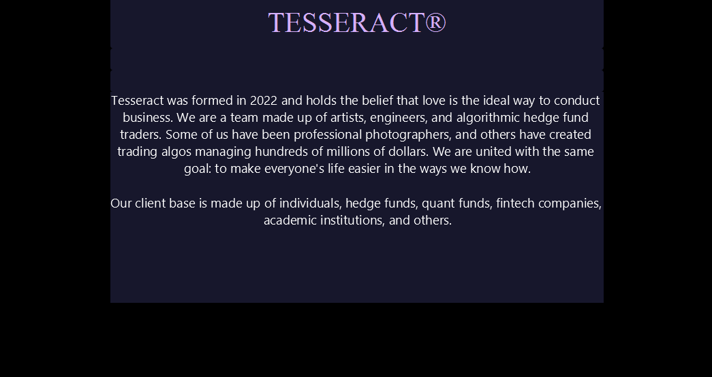

## Tesseract: Stock Market Forecasting :chart_with_upwards_trend: Engine with JavaFX and Facebook Prophet :money_with_wings:

In this project, I have made a desktop application with Java. I have used concepts of Object Oriented Programming, JavaFX and Facebook Prophet. This application 
extracts stock market data from api and stores it in csv. Then this data is read by pandas and used by Facebook Prophet to train and forecast the future. This 
forecast is also store in csv and graphs are plotted with matplotlib to visualize the results. I have also made real time stock selling and buying available in
this project with the help of Alpaca api. All the trades can be viewed in the Portfolio panel. This application also helps users in buying and selling stocks by 
finding the average rate of increase or decrease over the last 30 days. 

## Table of Contents
  * [What is Tesseract?](#what-is-tesseract?)
  * [Alpaca Trading](#alpaca-trading)
  * [Facebook Prophet](#facebook-prophet)
  * [Setup](#setup)
  * [Todos](#todos)
  * [Acknowledgements](#acknowledgements)
  * [Citation](#citation)
  * [Connect with me](#connect-with-me)


## What-is-Tesseract?


<p align="center">

</p>

<p align="center">

</p>

<p align="center">

</p>

<p align="center">

</p>

<p align="center">

</p>

<p align="center">

</p>


## Alpaca Trading
<p align="center">

</p>


## Facebook Prophet


## Setup

Let's get this thing running! Follow the next steps:

1. `git clone https://github.com/abideenml/Stock-Market-Analyzer`
2. Navigate into project directory `cd Stock-Market-Analyzer/pycast`
3. Get the `API token` from Alpaca website and add your key to `forecasting.py`
3. Create a new venv environment and run `pip install -r requirements.txt`
4. Move to the `src/main` folder and setup the jave project.

That's it! <br/>


## Todos:

Finally there are a couple more todos which I'll hopefully add really soon:

* Make a better UI of the project.
* Make a data pipeline with Kedro and MLflow.
* Deploy the models and learn the effect of drift on their performance.


## Acknowledgements

I found these resources useful (while developing this one):

* [Time series forecasting with Facebook Prophet](https://towardsdatascience.com/time-series-analysis-with-facebook-prophet-how-it-works-and-how-to-use-it-f15ecf2c0e3a)
* [LSTM Illustrated Guide](https://towardsdatascience.com/illustrated-guide-to-lstms-and-gru-s-a-step-by-step-explanation-44e9eb85bf21)
* [Alpaca trading](https://alpaca.markets/docs/introduction/)
* [JavaFX by BroCode](https://www.youtube.com/watch?v=_7OM-cMYWbQ&list=PLZPZq0r_RZOM-8vJA3NQFZB7JroDcMwev&ab_channel=BroCode)


## Citation

If you find this code useful, please cite the following:

```
@misc{Zain2023StockMarketAnalyzer,
  author = {Zain, Abideen},
  title = {stock-market-analyzer},
  year = {2023},
  publisher = {GitHub},
  journal = {GitHub repository},
  howpublished = {\url{https://github.com/abideenml/Stock-Market-Analyzer}},
}
```

## Connect with me

If you'd love to have some more AI-related content in your life :nerd_face:, consider:

* Connect and reach me on [LinkedIn](https://www.linkedin.com/in/zaiinulabideen/) and [Twitter](https://twitter.com/zaynismm)
* Follow me on 📚 [Medium](https://medium.com/@zaiinn440)
* Subscribe to my 📢 weekly [AI newsletter](https://rethinkai.substack.com/)!

## Licence

[](https://github.com/abideenml/Stock-Market-Analyzer/blob/master/LICENCE)